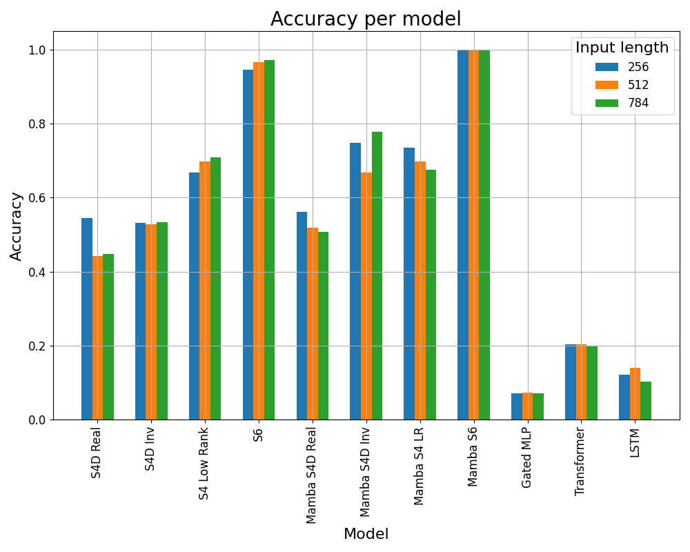
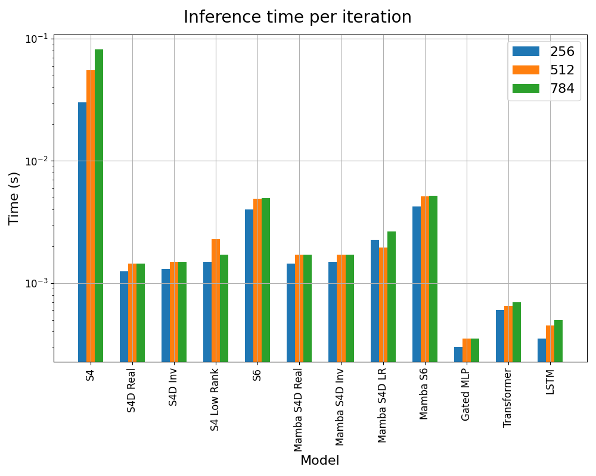
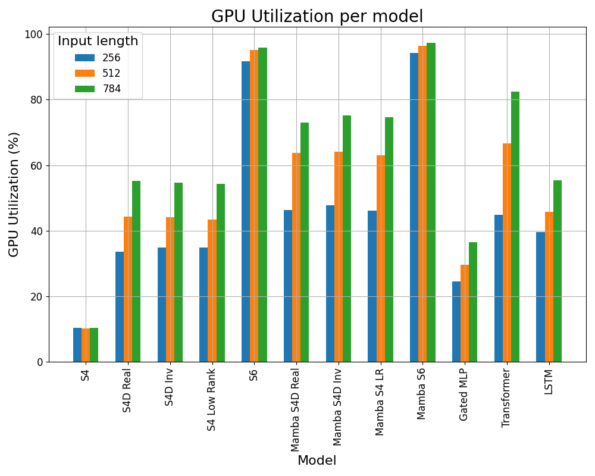

# State Space Models

The increasing demand for architectures that handle long-range dependencies efficiently has driven a wave of innovation beyond Transformer-based models. Among the most promising approaches are State Space Models (SSMs), a class of architectures derived from classical control theory and linear dynamical systems. SSMs aim to bridge the gap between sequence modeling efficiency and expressive capacity by leveraging structured mathematical formulations that support fast convolutional operations and long memory retention.

This report explores the foundational SSMs and their structured variants, including S4, S4 Low-Rank, S4 Diagonal, S6, Mamba, and GatedMLP.

## Models

This section presents detailed descriptions of the State Space models implemented in this project.

### S4

The foundational State Space Sequence model (S4) is derived from the continuous-time linear state space system:

$$
\begin{cases}
x'(t) & = Ax(t) + Bu(t)\\
y(t) & = Cx(t) + Du(t)\\
\end{cases}
$$

Here, $u(t)\in\mathbb{R}$ denotes the input signal, $x(t)\in\mathbb{R}^N$ represents the latent state, and $A, B, C, D$ are learnable parameters of the model. In practice, $D$ is often assumed to be zero and is therefore omitted.

This system is discretized for implementation as:

$$
\begin{cases}
x_k & = \bar{A}x_{k-1} + \bar{B}u_k\\
y_k & = \bar{C}x_k\\
\end{cases}
$$

where $\bar{A}, \bar{B}, \bar{C}$ denote the discretized forms of the corresponding continuous-time matrices.

While S4 is theoretically expressive, it suffers in practice from issues such as poor gradient scaling with respect to sequence length. To mitigate this, the matrix $A$ is typically initialized following the HiPPO (High-Order Polynomial Projection Operator) scheme:

$$
A_{ij} = -\begin{cases}
\sqrt{2i+1} \cdot \sqrt{2j +1} & if \quad i>j\\
i + 1 & if \quad i = j\\
0 & if \quad i<j
\end{cases}
$$

This initialization ensures stable dynamics and efficient representation of recent inputs while maintaining the potential for long-range information retention.

### S4 Low-Rank

The S4 Low-Rank variant generalizes the transition matrix $A$ to a diagonal plus low-rank structure:
$$
A = \Lambda + PQ^T
$$

where $\Lambda$ is a diagonal matrix and $PQ^T$ is a low-rank correction term. This formulation removes the HiPPO constraint, allowing $A$ to be fully learned during training.

The reduced structural rigidity yields greater flexibility and improved optimization while maintaining sufficient expressive power. The model strikes a balance between structure and learnability, enabling more efficient training and inference compared to the original S4.

### S4 Diagonal

S4 Diagonal further simplifies the architecture by restricting the transition matrix $A$ to be strictly diagonal, discarding both HiPPO and low-rank components.

This simplification significantly enhances computational and memory efficiency due to trivial parallelizability. Although its representational capacity is reduced, the model can still capture long-range dependencies when paired with expressive readout layers or embedding mechanisms. It is particularly well-suited to scenarios requiring lightweight and scalable models.

### S6

Selective State Space Models (S6) extend traditional SSMs by incorporating input-dependent selection mechanisms. This modification transforms SSMs from time-invariant to time-varying systems, wherein matrices $B$ and $C$ gain an additional length dimension, allowing them to adapt dynamically over the input sequence.

This architecture allows S6 to selectively retain or discard information across time steps based on input relevance. As a result, S6 achieves superior performance on tasks requiring selective memory, such as the selective copy task, outperforming earlier SSM variants including S4.

### Mamba

Mamba represents a modern, highly scalable SSM that builds upon S6. It integrates input-dependent gating to selectively control which state variables are updated at each time step—akin to attention mechanisms in Transformers, but with linear time and space complexity.

A key innovation in Mamba is the on-the-fly computation of convolution kernels via parameter-efficient neural filters and fused kernels. This enables the model to bypass full instantiation of the state space dynamics, significantly reducing memory overhead while preserving modeling power.

Mamba achieves competitive performance on challenging benchmarks, including language modeling and image generation, while maintaining the computational efficiency and scalability characteristic of SSMs.

### GatedMLP

Although not an SSM in the traditional sense, GatedMLP is often considered in the same context due to its sequence modeling capability without recurrence or attention. It consists of stacked multi-layer perceptrons with gating mechanisms, typically using element-wise multiplicative interactions, to model dependencies across tokens.

The typical form of a GatedMLP block is:

$$
y = (Wx)\odot\sigma(Vx)
$$

where $\odot$ denotes element-wise multiplication, and $\sigma$ is an activation function. While GatedMLPs lack explicit memory or recurrence, their gating allows for some level of sequential interaction when used in conjunction with positional embeddings or convolutional structures.

Despite their architectural simplicity and lack of explicit memory mechanisms, GatedMLPs can serve as efficient baselines. However, their performance generally lags behind that of structured SSMs.

## Results

This section describes the results obtained from the experiments conducted as part of this project. Specifically, evaluation focuses on the following key aspects:

- **Accuracy**: The performance of each model in terms of accuracy.
- **Time**: The time taken to train the model and make predictions.
- **Memory**: The amount of GPU memory used during training.
- **GPU Usage**: The GPU usage during training.

All experiments have been performed on a single NVIDIA RTX A4000 GPU with 16 GB of memory. Each model has been trained on a selective copy task using different input sizes (256, 512, 784), while keeping the number of tokens to memorize fixed at 16. Training was performed for up to 200000 epochs with a batch size of 64, using the Adam optimizer with a learning rate of 0.0001. To avoid overfitting and reduce training time, an early stopping mechanism has been implemented: training was terminated if the validation accuracy did not improve for 5000 steps.

### Accuracy

In this section, we present the accuracy results across different models. Accuracy is reported as the percentage of correct predictions on the test set. The figure below shows the performance of each model, highlighting how accuracy varies with different configurations.

The same data are reported in the table below:

| Model          | 256  | 512  | 784  |
|----------------|------|------|------|
| S4D Real       | 0.54 | 0.44 | 0.45 |
| S4D Inv        | 0.53 | 0.53 | 0.53 |
| S4 Low Rank    | 0.67 | 0.7  | 0.71 |
| S6             | 0.95 | 0.97 | 0.97 |
| Mamba S4D Real | 0.56 | 0.52 | 0.51 |
| Mamba S4D Inv  | 0.75 | 0.67 | 0.78 |
| Mamba S4 LR    | 0.74 | 0.7  | 0.68 |
| Mamba S6       | 1.0  | 1.0  | 1.0  |
| Gated MLP      | 0.07 | 0.07 | 0.07 |
| Transformer    | 0.2  | 0.2  | 0.2  |
| LSTM           | 0.12 | 0.14 | 0.1  |

Among all evaluated models, Mamba + S6 achieved the best performance, consistently reaching 100% accuracy across all datasets. The integration of the Mamba architecture significantly enhanced the performance of the S4 model, and more broadly, it consistently improved accuracy across all model variants.

In contrast, the Gated MLP and Transformer models showed poor performance, with significantly lower accuracy compared to other architectures. The LSTM model performed slightly better than Gated MLP and Transformer, but still lagged behind the top-performing models by a considerable margin.

### Time

This section presents the training and inference times for the different models evaluated.

#### Training Time
The training time is measured in seconds and represents the duration required to complete a single training step, including both the forward and backward passes. The results below compare the per-step training times across models, highlighting differences in computational efficiency.

The same data are reported in the table below:

| Model          | 256    | 512    | 784    |
|----------------|--------|--------|--------|
| S4             | 169.14 | 288.95 | 483.29 |
| S4D Real       | 4.43   | 5.72   | 6.49   |
| S4D Inv        | 4.61   | 5.94   | 6.75   |
| S4 Low Rank    | 5.31   | 6.58   | 7.38   |
| S6             | 16.82  | 30.74  | 38.54  |
| Mamba S4D Real | 6.37   | 8.99   | 10.98  |
| Mamba S4D Inv  | 6.96   | 9.06   | 11.31  |
| Mamba S4D LR   | 7.35   | 9.92   | 12.14  |
| Mamba S6       | 32.6   | 60.58  | 76.23  |
| Gated MLP      | 1.56   | 2.03   | 2.28   |
| Transformer    | 5.06   | 7.59   | 10.68  |
| LSTM           | 1.24   | 1.51   | 1.79   |

Both the table and figure clearly show that the S4 model is the slowest to train, with a substantial time gap compared to all other models. In contrast, S4D models are significantly faster, with S4D Real being the most efficient among them.

The introduction of the Mamba architecture consistently leads to a noticeable increase in training time across all model variants. Regarding the S6 model, it is considerably slower than the S4D models but still faster than the original S4. This increased training time is primarily due to the model’s recurrent structure, which adds computational overhead during the forward and backward passes. However, a more optimized implementation of the parallel scanning routine in S6 could potentially reduce this gap and bring its performance closer to that of other architectures.

As for the LSTM and Transformer models, their training times are comparable to the S4D models and significantly faster than S6.

#### Inference Time

This section presents the inference times for the different models. Inference time is measured in seconds and reflects the duration required to complete a single forward pass (without gradient computation).

The same data are reported in the table below:

| Model          | 256  | 512   | 784   |
|----------------|------|-------|-------|
| S4             | 6.02 | 11.11 | 16.37 |
| S4D Real       | 0.25 | 0.29  | 0.29  |
| S4D Inv        | 0.26 | 0.3   | 0.3   |
| S4 Low Rank    | 0.3  | 0.46  | 0.34  |
| S6             | 0.8  | 0.98  | 0.99  |
| Mamba S4D Real | 0.29 | 0.34  | 0.34  |
| Mamba S4D Inv  | 0.3  | 0.34  | 0.34  |
| Mamba S4D LR   | 0.45 | 0.39  | 0.53  |
| Mamba S6       | 0.85 | 1.03  | 1.04  |
| Gated MLP      | 0.06 | 0.07  | 0.07  |
| Transformer    | 0.12 | 0.13  | 0.14  |
| LSTM           | 0.07 | 0.09  | 0.1   |

Comparing inference times to training times, we observe that training is significantly slower across all models. This is expected, as training involves not only the forward pass but also gradient computation and weight updates, whereas inference requires only the forward pass.

While the S4 model remains the slowest during inference, the performance gap between it and the other models is smaller than during training. The S6 model continues to be slower than both Transformer and LSTM models, reflecting its inherently more complex recurrent computations even in the absence of backpropagation.

### Memory

This section presents the GPU memory usage of the different models during training. Memory usage is measured in megabytes (MB) and reflects the total amount of GPU memory consumed throughout the training process. The plot below illustrates the memory footprint of each model, enabling a comparison of their computational resource requirements.

The same data are reported in the table below:

| Model          | 256    | 512    | 784     |
|----------------|--------|--------|---------|
| S4             | 715.7  | 901.7  | 1077.7  |
| S4D Real       | 677.7  | 827.7  | 983.7   |
| S4D Inv        | 679.7  | 847.7  | 1021.7  |
| S4 Low Rank    | 679.7  | 849.7  | 1027.7  |
| S6             | 2675.7 | 4763.7 | 5591.7  |
| Mamba S4D Real | 895.7  | 1273.7 | 1545.7  |
| Mamba S4D Inv  | 899.7  | 1293.7 | 1559.7  |
| Mamba S4 LR    | 903.7  | 1265.7 | 1585.7  |
| Mamba S6       | 4911.7 | 9107.7 | 10975.7 |
| Gated MLP      | 543.7  | 565.7  | 593.7   |
| Transformer    | 655.7  | 759.7  | 849.7   |
| LSTM           | 585.7  | 673.7  | 739.7   |

As shown in both the table and the figure, all models—except S6 and its Mamba variant—exhibit similar GPU memory usage during training. The S6 model consumes the most memory, with a substantial margin compared to the others. Additionally, incorporating the Mamba architecture leads to a noticeable increase in memory usage across the models.

### GPU Usage

This section presents the GPU utilization of the different models during training. GPU usage is measured as a percentage and reflects the proportion of available GPU computational resources utilized throughout the training process. The plot below illustrates GPU usage across models, highlighting differences in computational efficiency and hardware utilization.

The same data are reported in the table below:

| Model          | 256   | 512   | 784   |
|----------------|-------|-------|-------|
| S4             | 10.37 | 10.21 | 10.35 |
| S4D Real       | 33.51 | 44.32 | 55.28 |
| S4D Inv        | 34.82 | 44.12 | 54.56 |
| S4 Low Rank    | 34.92 | 43.32 | 54.26 |
| S6             | 91.72 | 95.14 | 95.88 |
| Mamba S4D Real | 46.34 | 63.79 | 72.9  |
| Mamba S4D Inv  | 47.84 | 64.0  | 75.12 |
| Mamba S4 LR    | 46.09 | 62.93 | 74.57 |
| Mamba S6       | 94.16 | 96.44 | 97.27 |
| Gated MLP      | 24.61 | 29.63 | 36.5  |
| Transformer    | 44.77 | 66.57 | 82.49 |
| LSTM           | 39.61 | 45.82 | 55.4  |

As we can see from both the table and the figure, the GPU utilization is quite low for all the models except S6, its Mamba version the Transformers model. Moreover, the introduction of Mamba always leads to an increase of the GPU utilization.

The S4 model exhibits the lowest GPU usage, which, combined with its long training times, highlights its computational inefficiency. Furthermore, GPU utilization increases with longer sequence lengths across all models, reflecting the growing computational demands.